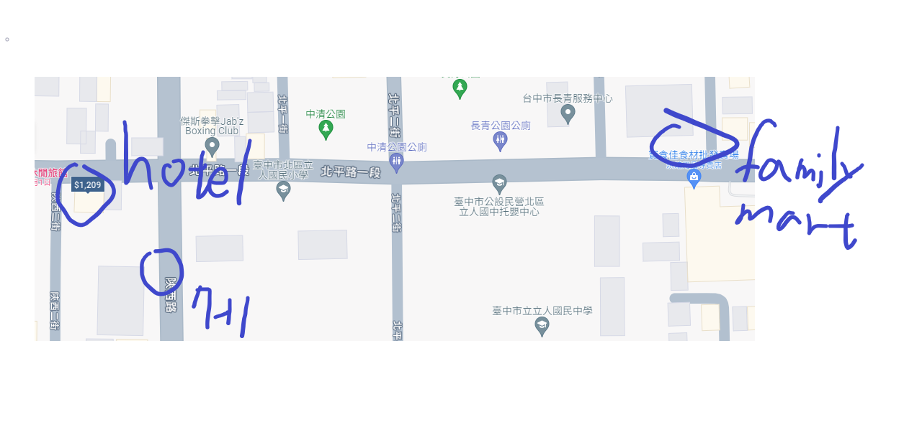
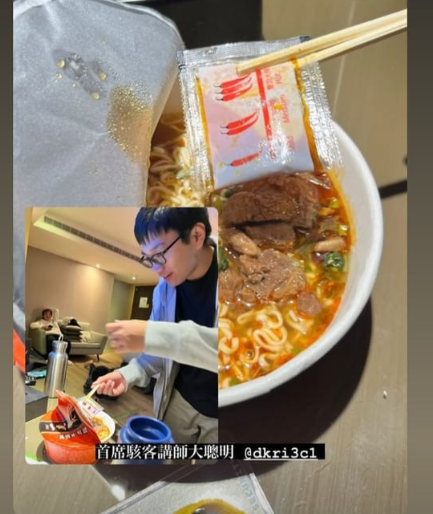
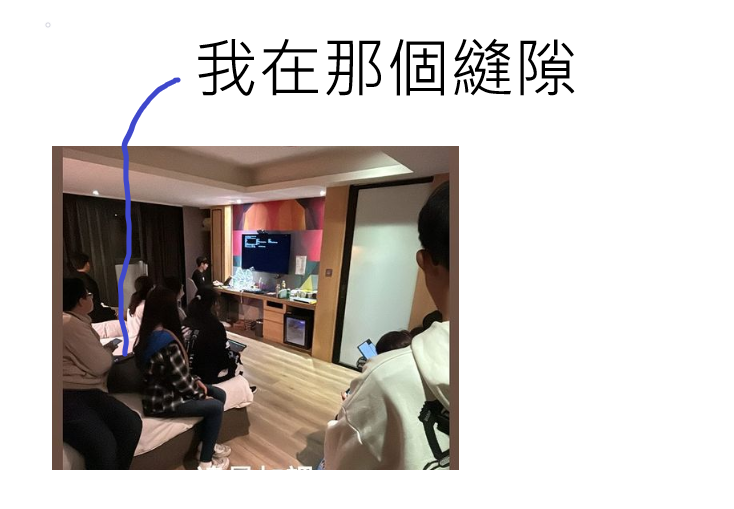
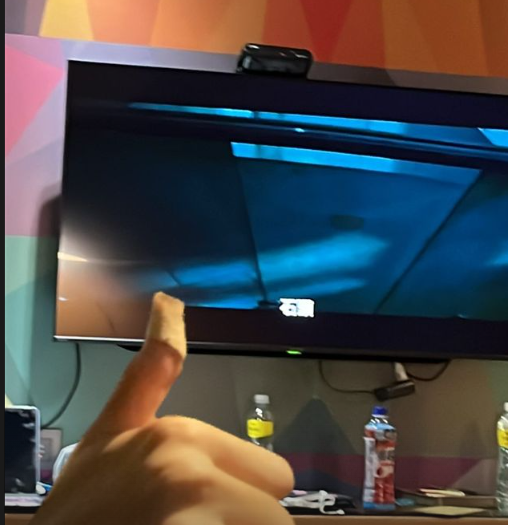

## 前言
這邊寄放了我在寒訓擔任資安講師遇到的趣事

## Day1
我們晚上在飯店肚子餓的時候要去`便利商店`買東西吃,結果我們不知道飯店一出去右轉就有**7-11**,然後我們跑去距離飯店**200**多公尺的**全家**,然後那天室外溫度只有十幾度甚至更低  
  附上一張示意圖

BTW我在泡麵的時候忘記把我的調理包**內容物**丟到裡面= =  
  放上一個示意圖  
    

## Day2
因為意識到學員可能對於我們的課程沒有過多的了解,所以我們在晚上11:00 -> 1:00為助教時間,結果我在另一個講師 **@osca**講Linux指令的時候**睡死在地板上面**,然後總召問我在哪裡的時候,每一個坐在床上的學員都指著地上的我QQ

我們出題三人組的其他兩個人 **@osca** **@Chao**在半夜三點和其他隊輔一起看女鬼橋,結果有隊輔過來按門鈴被嚇到  

~~ㄜㄜ,至於我睡死ㄌ:D~~

然後然後,還有睡著的總召被我們嚇醒的照片ouo

## Day3
沒有前幾天來的快樂QQ,反正就是快樂吃烤肉的局,然後最後回程時我在遊覽車上面暈車= =,以後記得要帶暈車藥

**喔喔然後分享一下我們CTFd伺服器的近況**

## 總結
學弟妹們心動ㄌ嗎!? 加入**中電會**!!