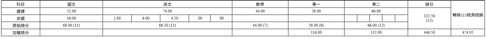

## 結果

|  學校 | 一階 | 二階 | 結果 |
| -------- | -------- | -------- | -------- |
| 北科資工 一般組     |   超額比序被篩 (差兩級分)   |  X    | X |
| 北科資工 資安組     | 過ㄌ     |  83.45   | 正取 1 |
| 台科資管 一般組     | 沒過，國文差兩級分     |  X   | X |

## 前言

這篇文章主要是寫給資電類學弟妹ㄉ升學文章，雖然我的成績也不是很好，但是我想將自己一路走來的經歷與心得都講出來，希望這些內容能讓你們對未來有更多方向，也少走一些彎路。

## 讀書時間

希望珍惜自己生命的你們，不要像我一樣統測前兩個月再讀，我之所以這麼晚開始捲，是因為當初特選時太有自信，心想「應該保底會上一間吧」，結果直接大翻車，只好硬著頭皮考統測。這兩個月大致上的生活就是平日去學校讀書，讀 2 ~ 3 小時休息一下，可能滑個幹片或是跟隔壁同學鬧一下，放學之後留在學校自習到 8. 然後高歌離席，禮拜六則是從早上 10. 讀到 5. 多，禮拜日可能就是看自己要不要休息或是繼續捲醬子。

## 模擬考

國排 

|  模考次數 | 排名 | 
| -------- | -------- | 
| 一  | 851 |  
| 二  | 572 |  
| 三  | 425 |  
| 五  | 438 |  

我覺ㄉ模擬考的分數不用太在意，最後的成績差不多比自己模考最高多了 60 分以上，國排的話進步了 100 名，主要是模擬考的難度根本就是來搞你心態的，一堆統測不會考的怪題= =，以我自己為例子，我模擬考專一沒有高過 10 級分，統測 13 級，然後專二都考 13 以上 ，考出來只有 12 ，數學也是，從來沒有高過 12 級，統測就考ㄌ個 13，國文英文的話就差不多。

## 統測

統測前記得條好時差，然後食物不要吃太油。
個人建議直到考完都不要對答案，因為如果你對完答案發現自己寫對了，當然會很開心，反過來，如果你發現自己寫錯了，你可能會開始懷疑自己：「我當初怎麼會寫這個？」接著自我懷疑，破壞整個考試的心情。

## 推甄

這部分我就吃特選的老本ㄌ，不然我現在連北科資工都沒有xD，備審那些有問題的可以 dc 敲我 ID:dkri3c1

## 結語

回顧曾經那個趾高氣昂的自己 xDD
還記得特選前，在搭接駁車前往 HITCON 的路上，我還跟 [naup](https://naup.mygo.tw/) 聊這屆最強的高職生是誰，結果我毫不猶豫就說「我自己」。現在想起來真的不知道當初哪來的勇氣🤣

特選結果還沒出來，我就已經開始看學校的課表、研究未來要修什麼課…現在回頭看真的想捶爆當時的自己 www
後來某種程度上也覺得自己變得有點像 [Zeus](https://www.youtube.com/shorts/WvYzdU_kAAk) => 事情沒塵埃落定前，臉上絕對看不到笑容 

最後，真的非常感謝一路以來幫助我的學長姐們，還有願意幫我惡補專業的科主任，以及在資安圈中遇到的每一位老師及朋友。沒有你們，就沒有現在的我。