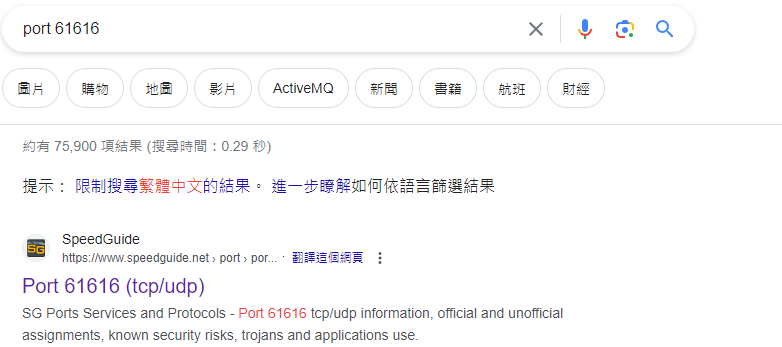

## Q1

By identifying the C2 IP, we can block traffic to and from this IP, helping to contain the breach and prevent further data exfiltration or command execution. Can you provide the IP of the C2 server that communicated with our server?

---------

要找出攻擊者的ip我們可以用``Endpoint``觀察

點進去發現有兩個ip接受的流量特別多

那我們可以隨便找一下這兩個ip的封包傳輸內容

點進去發現藍色的傳輸內容疑似為攻擊;那我們要怎麼知道藍色的內容是誰給的呢?

在左下角可以選

``answer : 146.190.21.92``

## Q2

Initial entry points are critical to trace back the attack vector. What is the port number of the service the adversary exploited?

---------

去``conversation``看

點進去然後點TCP

會發現在一開始 146.190.21.92這個ip用``47284``送東西給134.209.197.3的``61616``port  
那答案這樣就出來了

``ans : 61616``

## Q3
Following up on the previous question, what is the name of the service found to be vulnerable?

--------

撈了很久的Wireshark還是沒找到，最後想說去看看``61616``這個port到底在幹嘛

結果第一個點進去就找到了

``ans : Apache ActiveMQ``

## Q4

The attacker's infrastructure often involves multiple components. What is the IP of the second C2 server?

------------

觀察一下被駭的server有沒有傳送東西給其他陌生的ip 發現確實有

看一下封包內容

傳了一個叫做``docker``檔案給他
然後再去``conversation``看一下server有沒有丟其他東西給陌生的ip

發現沒有  
於是就直接輸入ㄌ

``ans : 128.199.52.72``

## Q5

Attackers usually leave traces on the disk. What is the name of the reverse shell executable dropped on the server?

-----

看一下剛剛那個封包的內容會發現

他在``docker``這個檔案裡面輸入bash指令  

ps:這個``docker``是一個ELF執行檔

``ans : docker``

## Q6

What Java class was invoked by the XML file to run the exploit?

---------

一樣再看一下剛剛那個封包

``ans : java.lang.ProcessBuilder``

## Q7

To better understand the specific security flaw exploited, can you identify the CVE identifier associated with this vulnerability?

-----

丟GOOGLE就發現答案ㄌ

``ans : CVE-2023-46604``

## Q8
What is the vulnerable Java method and class that allows an attacker to run arbitrary code? (Format: Class.Method)

------

我打不出來T_T

## 後記
基本上快一年多沒有碰wireshark這個鬼東西ㄌ(雖然前陣子T貓的時候有稍微玩一下)，感覺好不熟悉QAQ，希望我能透過練習上面的Lab讓我在分區的時候藍隊不會死那麼慘。