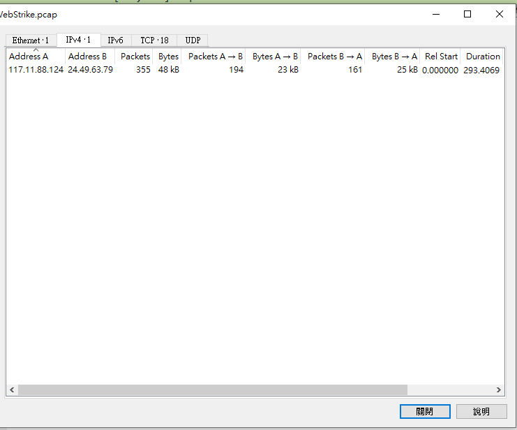
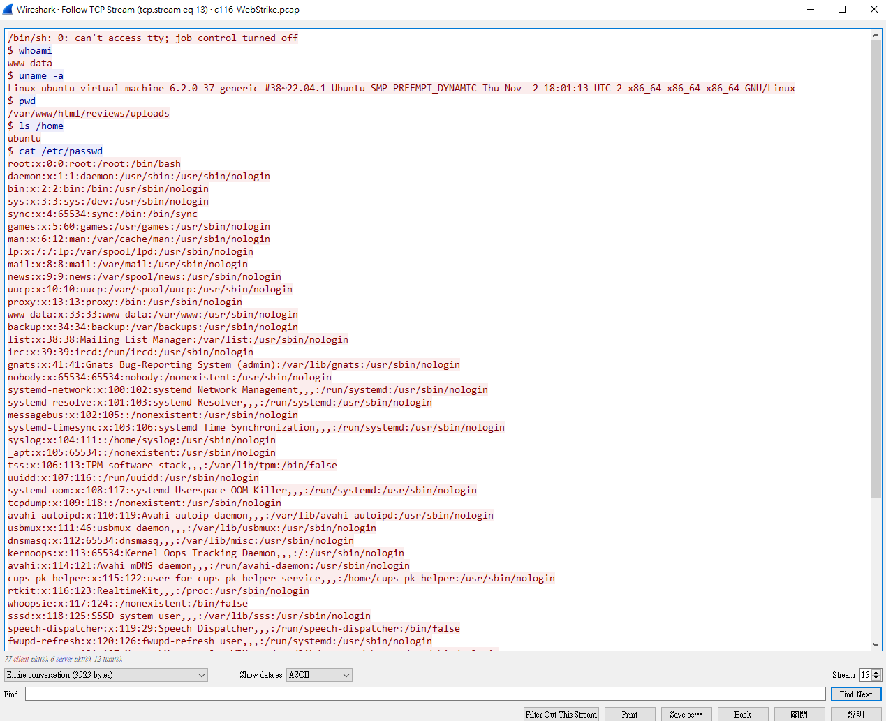
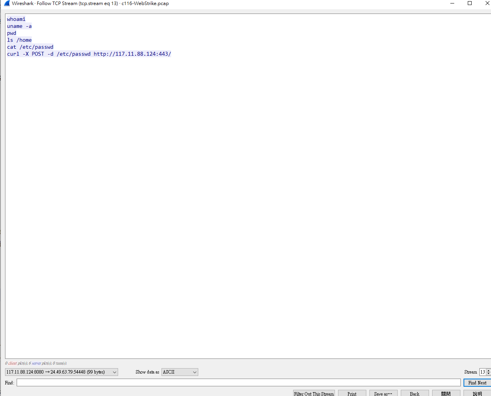
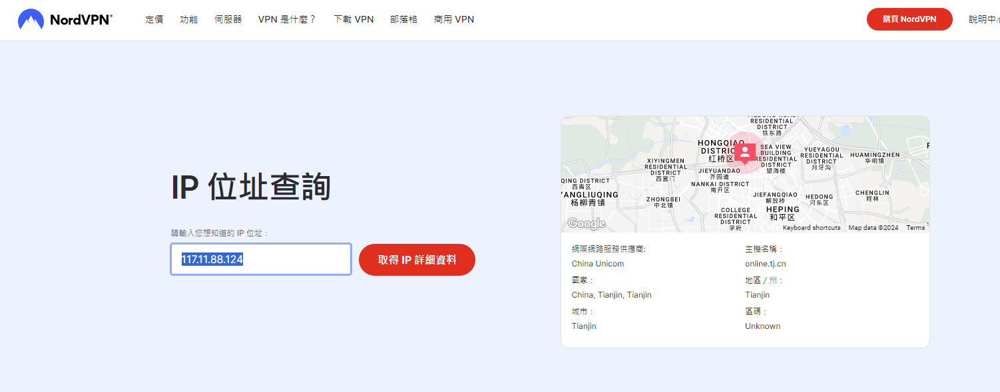
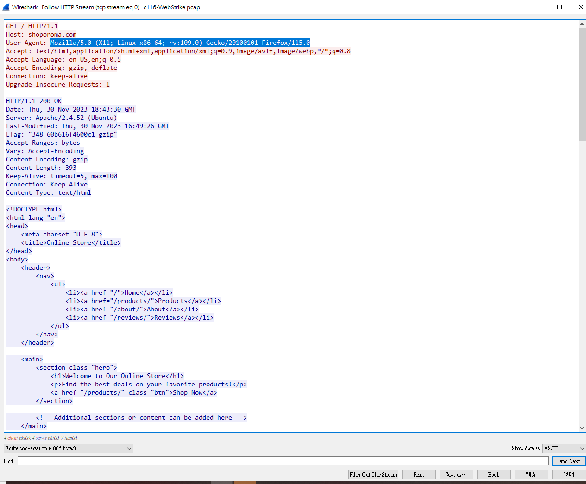
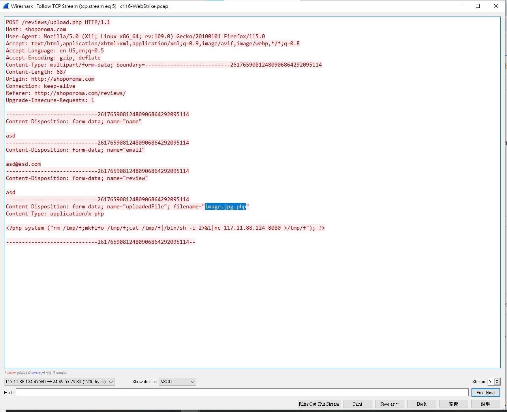
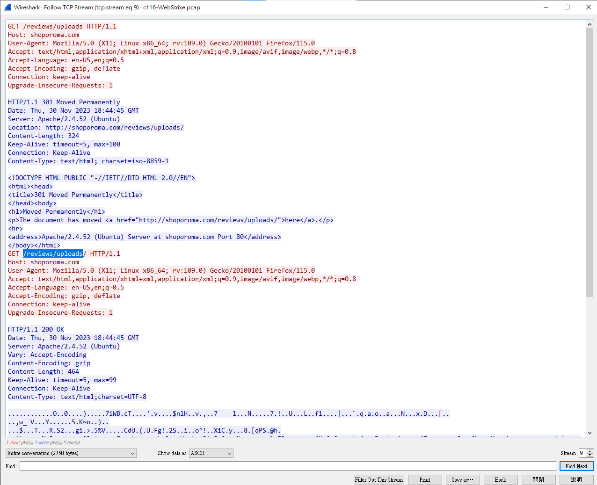
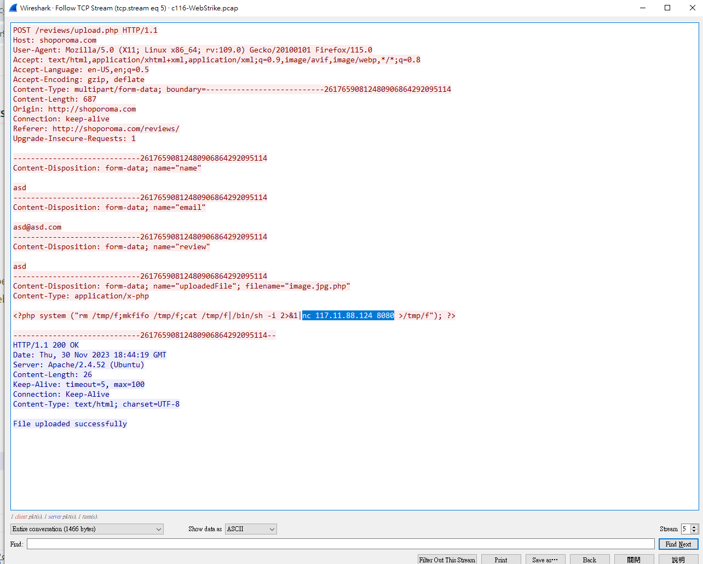
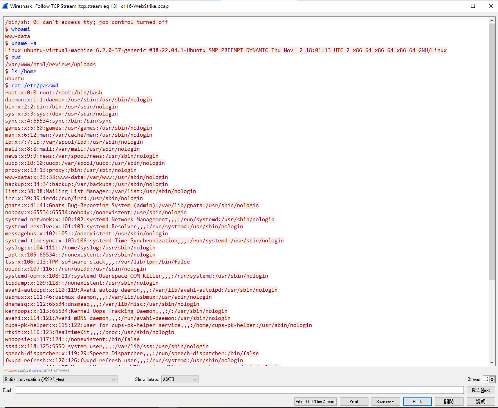

## Q1

Understanding the geographical origin of the attack aids in geo-blocking measures and threat intelligence analysis. What city did the attack originate from?

------------

先去 ``conversation`` 看有哪些ip

發現只有兩個，於是就去tcp看有沒有攻擊的相關痕跡   
發現 ``Stream 13`` 有

接下來就看誰是攻擊者ㄌ

答案便是``117.11.88.124`` 那依據題目的要求我們需要找到攻擊者在哪

``ans : Tianjin``

## Q2

Knowing the attacker's user-agent assists in creating robust filtering rules. What's the attacker's user agent?

--------

點一個``HTTP Protocol``的來看

``ans : Mozilla/5.0 (X11; Linux x86_64; rv:109.0) Gecko/20100101 Firefox/115.0``

## Q3

We need to identify if there were potential vulnerabilities exploited. What's the name of the malicious web shell uploaded?

-----------

一樣翻一下TCP看攻擊者的攻擊過程  
最後在``Stream 5``發現了整個犯案過程ww

``ans : image.jpg.php``

## Q4

Knowing the directory where files uploaded are stored is important for reinforcing defenses against unauthorized access. Which directory is used by the website to store the uploaded files?

---------------

同上
最後在 ``Stream 9``發現

##  Q5

Identifying the port utilized by the web shell helps improve firewall configurations for blocking unauthorized outbound traffic. What port was used by the malicious web shell?

-------------

在之前的``Stream 5``發現攻擊者上傳的webshell，我們可以觀察上面的payload

發現他已``8080``這個port當webshell

``ans: 8080``

## Q6

Understanding the value of compromised data assists in prioritizing incident response actions. What file was the attacker trying to exfiltrate?

------------

在之前的``Stream 13``看到了他``RCE``進去之後輸入的指令

發現他想要去``etc/passwd``拿``root``的帳號  
可是這題只讓我們輸入6個字，所以我想了想就輸入``passwd``，然後答案就對ㄌ:D

``ans : passwd``

## 後記

數位鑑識好玩:D