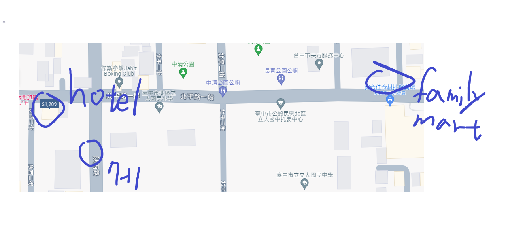
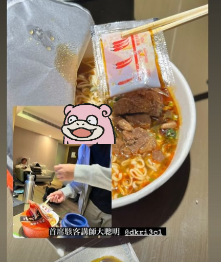
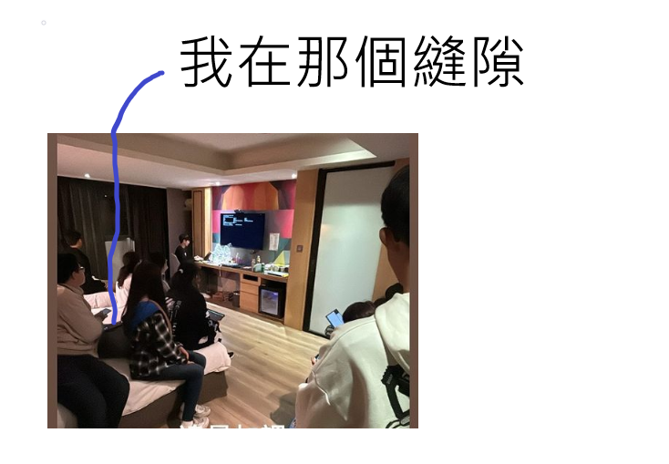
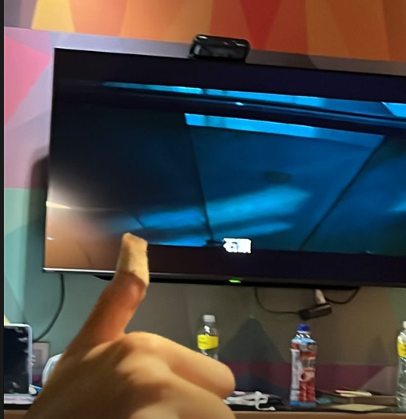

## 前言
這邊寄放了我在寒訓擔任資安講師遇到的趣事

## Day1
我們晚上在飯店肚子餓的時候要去`便利商店`買東西吃,結果我們不知道飯店一出去右轉就有**7-11**,然後我們跑去距離飯店**200**多公尺的**全家**,然後那天室外溫度只有十幾度甚至更低  
  附上一張示意圖

BTW我在泡麵的時候忘記把我的調理包**內容物**丟到裡面= =  
  放上一個示意圖  
    

## Day2
因為意識到學員可能對於我們的課程沒有過多的了解,所以我們在晚上11:00 -> 1:00為助教時間,結果我在另一個講師 **@osga**講Linux指令的時候**睡死在地板上面**,然後總召問我在哪裡的時候,每一個坐在床上的學員都指著地上的我QQ

我們出題三人組的其他兩個人 **@osga** **@Chao**在半夜三點和其他隊輔一起看女鬼橋,結果有隊輔過來按門鈴被嚇到  

~~ㄜㄜ,至於我睡死ㄌ:D~~

然後然後,還有睡著的總召被我們嚇醒的照片ouo

## Day3
沒有前幾天來的快樂QQ,反正就是快樂吃烤肉的局,然後最後回程時我在遊覽車上面暈車= =,以後記得要帶暈車藥

**然後這是最後一天CTF的writes up**

https://hackmd.io/@osga/S1YEiVZcp

**喔喔然後分享一下我們CTFd伺服器的近況**

## 總結
雖然這一篇的東西大部分都是在講我在寒訓搞耍的事情,
但說實話,我其實對於我這一年內的成長感到十分的欣慰,想當初從一個什麼都不會的小高一，慢慢學會了Linux Command、學會了Web等那些CTF技巧，也學會了一些講課的技巧。這讓我更確信我當初的選擇是正確的，雖然我起步的時間比別人晚，但我相信我能用那些努力來彌補的差距!