---
## 原神帳號外流
- tag: `Medium`
- 大學&社會人士平台: 38/226  
- 高中職生平台: 36/84

題目敘述:  
```
小朝是一位來自THJCC這間公司的資安工程師,有一次上班摸魚中無意間開啟了原神並且登入了帳號,然而天真的他居然忘了用vpn就直接登入遊戲,導致公司的藍隊演練工程師攔截封包時,意外獲取了他的帳號,於是身為首席駭客的你並想登入他的原神帳號並且幹走他的遊戲道具。

請在此封包中找到正確的帳號密碼並登入取得flag

Author : dkri3c1
```

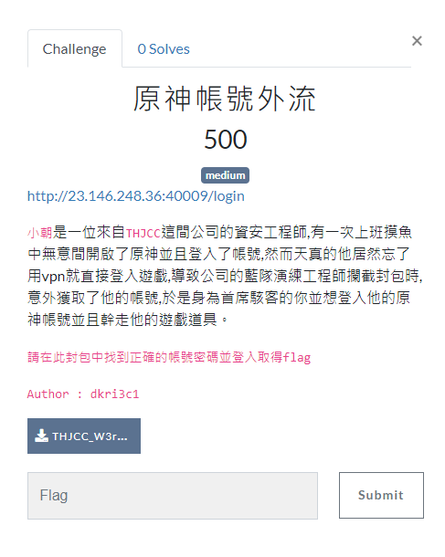

          開始撈封包www，會發現第`8`個封包開始便嘗試登入帳號

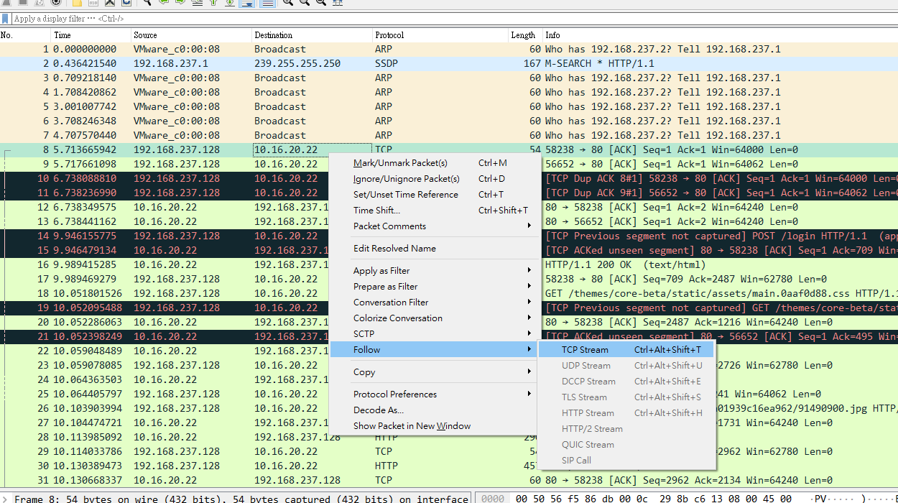


預期解是觀察封包內容並且拿到正確的帳號密碼(而非一個一個爆破):

`name=Frieren&password=B3stan1me` (芙莉蓮好看owob)

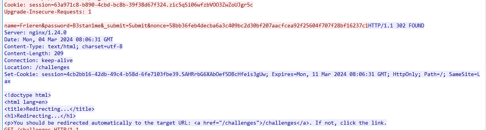

最後拿去登入那個網頁就有flagㄌ


---

---
## Evil Form
- tag: `Hard`
- 大學&社會人士平台: 11/226  
- 高中職生平台: 16/84

題目敘述:  
```
Asia G0dTone在一次地下城冒險中,受到了魔鬥凱薩的攻擊,並且受困於名為表單競技場的技能中,身為首席駭客兼勇者的你請英雄救美吧!
https://forms.gle/RwfTU2a8LdBZUgxX7
Author : dkri3c1


註: 本題所有圖片都跟隱寫術毫無關聯
```
---

Hint1:

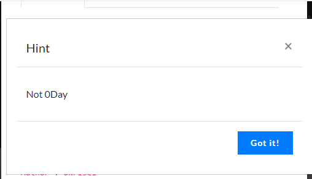

Hint2:

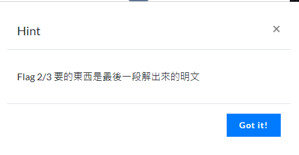

Hint3:

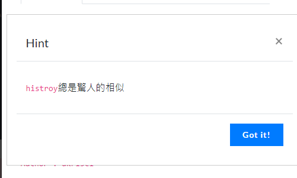

Hint4:

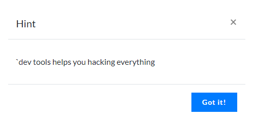

點進去連結會發現你只能選擇挑戰這個題目

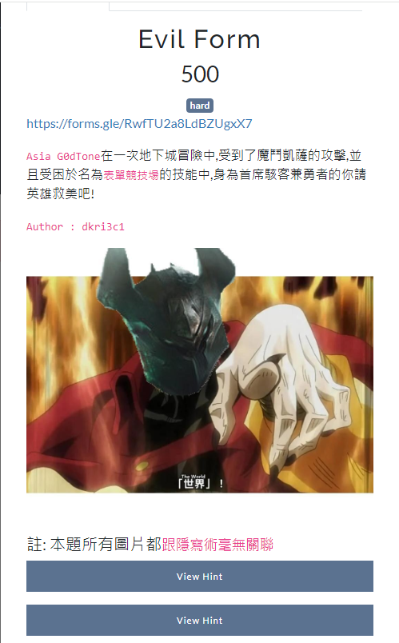

點繼續之後會發現一個讓你回答`1+1=?`的答案框，隨便輸入東西之後會發現還是卡在這個表單迴圈裡面，開hint就會發現他提示了一個叫做history的東西，於是利用dev tools搜尋看看

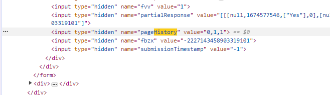

會發現後面有`value`可以更改，透過修改後發現前一項的數值從`1` -> `2`便會拿到flag(1/3)，給一個圖片支援ww

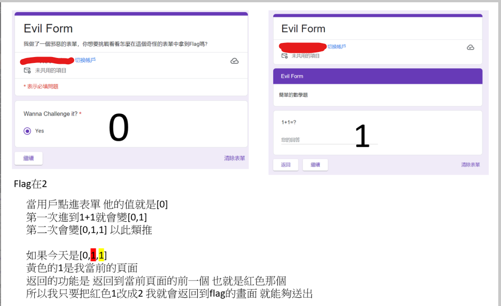

然後再往回改，把`2`改成`3`，會出現一個凱薩衛浴，拿去丟 ROT decoder就會拿到(2/3)flag

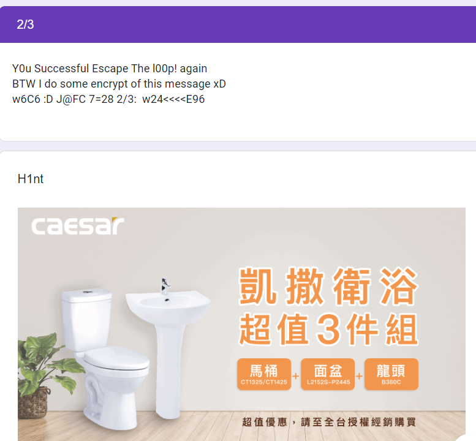

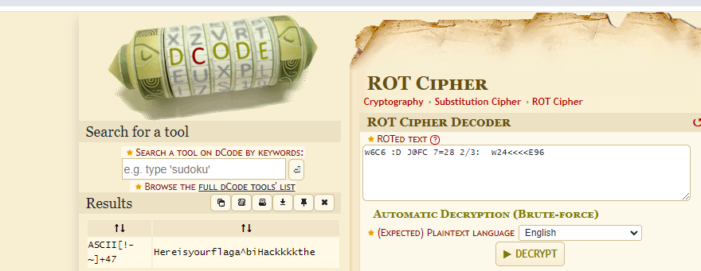

再改最後一次，把`3`改成`4`，會出現一張base64的梗圖，拿去丟base64 decoder就會拿到 (3/3)flag

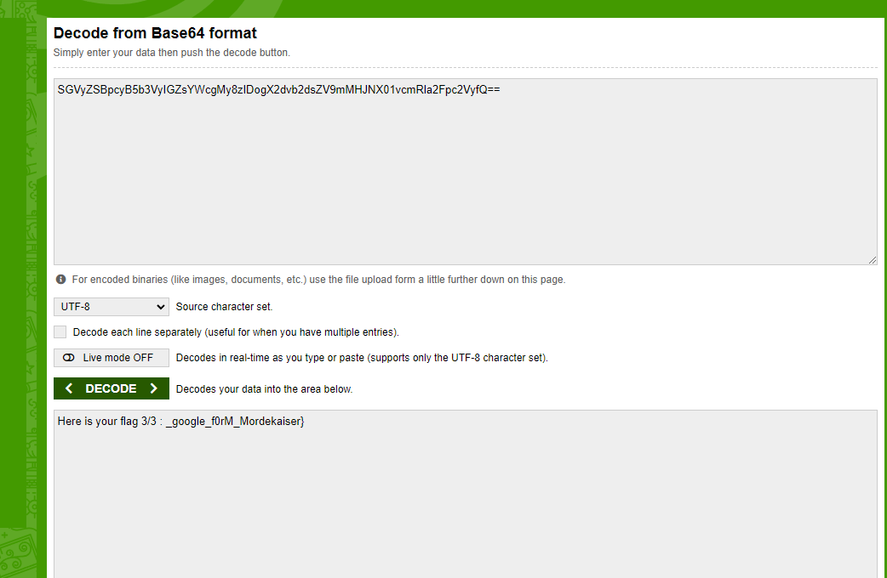

## 後記
因為 `yuan`的一句話就讓我們跑來和這些電神一起出題了ww，這次出了兩題怪題，發現自己在出題的時候很常忽略細節= =，`hint2` 把 `history` 打成 `histroy` 然後最後的 `hint4`少包一個符號導致他看起來很醜。不過看完大家的wp之後發現 `Evil Form` 這題好像出爛了，因為超多人的解法都是非預期解(題外話:這題已經nerf超多ㄌww)，然後原神那題要變 `Insane` 好像就把繳交次數設限在一次就好惹xDD，最後的最後希望大家在這次比賽中玩的開心!期待明年可以請今年的前幾名來出題ww